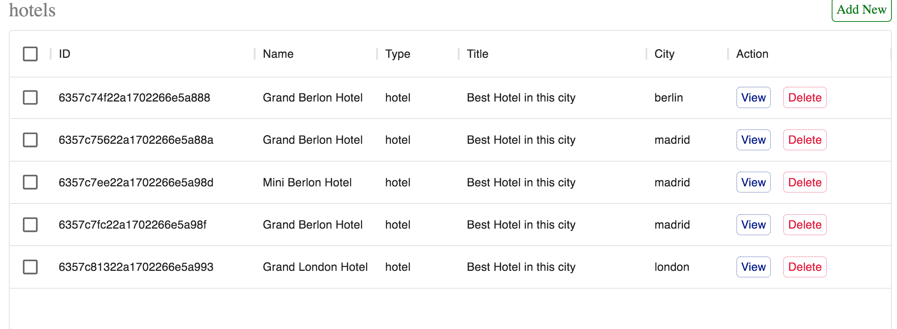

# Booking application
For improoving skills application.
____
### Technology stack: React, Costomer Hooks, Axios, Node.js, MongoDB, Reac-router
___
### start:
npm start
___
Pizza shop with:
1. Admin panel
2. Admin login pages
3. Hotel search panel
4. Choose Hotel in the city
5. Room reserve
6. API (MongoDB)

___

# Screans:

### Main page:

### Search page:

### Resrvation:

### Admin panel:

### Admin panel(Add users):

### Admin panel(Add hotels):

___
##
Not full application becouse I can't send full. Only for your understanding.